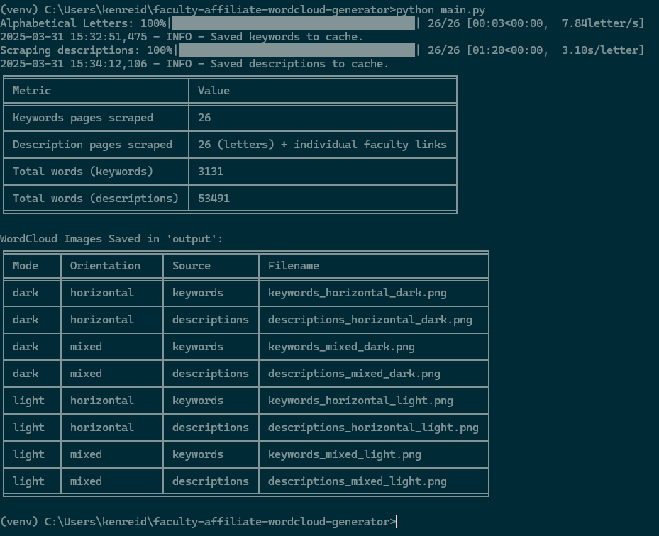
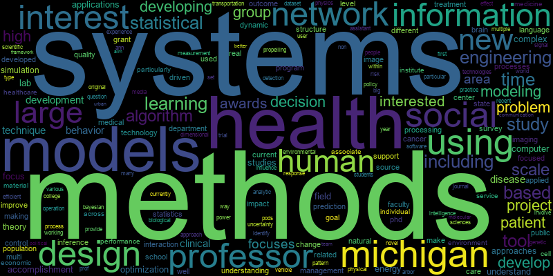

# UMich Faculty Research Interests Scraper & Word Cloud Generator

This Python script scrapes research interests from the University of Michigan affiliated faculty pages, cleans the text by converting it to lowercase and removing common DS-related terms (loaded from an external file), NLTK stopwords, and words shorter than three characters, and then generates eight word clouds. The script scrapes both the main A–Z index pages for keywords/short descriptions and individual faculty pages for full research descriptions, and it saves the word cloud images without displaying them.

> **Example Command Output:**  
> The following screenshot shows how the script runs in the command prompt.
>
> 

## Features

* **Dual Data Sources:**  
  Scrapes the main A–Z index pages for keywords/short descriptions and follows each faculty link to scrape full research descriptions.

* **Text Cleaning:**  
  Converts all text to lowercase, removes common DS-related terms (loaded from `removed_words.txt`), filters out NLTK stopwords, and excludes words with fewer than 3 characters.

* **Word Cloud Generation:**  
  Automatically produces eight word cloud images:
  
  * For each **mode** (light and dark):
    * **Horizontal Only:**  
      - One word cloud from the keywords variant (using only horizontal orientation, `prefer_horizontal=1.0`)
      - One word cloud from the descriptions variant (using only horizontal orientation, `prefer_horizontal=1.0`)
    * **Mixed Orientation:**  
      - One word cloud from the keywords variant (using mixed orientation, `prefer_horizontal=0.5`)
      - One word cloud from the descriptions variant (using mixed orientation, `prefer_horizontal=0.5`)

* **Caching:**  
  Saves scraped data to text files (`keywords.txt` and `descriptions.txt`) to avoid repeated scraping.

* **Output Handling:**  
  Word cloud images are saved to the `/output/` directory. The images are not displayed interactively.

> **Example Word Cloud:**  
> The image below shows an example word cloud generated by the script.
>
> 

## Installation

### Prerequisites

* Python 3.7 or higher  
* pip

### Using a Virtual Environment (Recommended)

1. **Clone the repository:**

   ```bash
   git clone https://github.com/DrKenReid/midas-faculty-scraper-wordcloud-generator.git
   cd midas-faculty-scraper-wordcloud-generator
```

2. **Create a virtual environment:**

   On macOS/Linux:

   ```bash
   python3 -m venv venv
   ```

   On Windows:

   ```bash
   python -m venv venv
   ```

3. **Activate the virtual environment:**

   On macOS/Linux:

   ```bash
   source venv/bin/activate
   ```

   On Windows:

   ```bash
   venv\Scripts\activate
   ```

4. **Install required packages:**

   ```bash
   pip install -r requirements.txt
   ```

## Usage

Run the script by executing:

```bash
python scraper.py
```

The script will:

1. Scrape the main A–Z pages for keywords/short descriptions.

2. Follow each faculty link to scrape full research descriptions.

3. Clean the text (convert to lowercase, remove common DS terms from `removed_words.txt`, NLTK stopwords, and words shorter than 3 characters).

4. Generate and save eight word clouds:

   * For **light mode** and **dark mode**:

     * One word cloud (horizontal only) generated from keywords.

     * One word cloud (horizontal only) generated from descriptions.

     * One word cloud (mixed orientation) generated from keywords.

     * One word cloud (mixed orientation) generated from descriptions.

## Configuration

The following aspects can be configured directly in the script:

* **Dark/Light Mode:**\
  The script generates word clouds for both dark mode (black background) and light mode (white background).

* **Orientation:**\
  Two orientation settings are used:

  * **Horizontal Only:** (`prefer_horizontal=1.0`)

  * **Mixed Orientation:** (`prefer_horizontal=0.5`)

* **Removed Words List:**\
  Common DS-related terms are loaded from the external file `removed_words.txt`. Edit this file to update the list of terms to remove.

* **Caching:**\
  The script caches scraped data in two files:

  * `keywords.txt`: Contains aggregated text from the index pages.

  * `descriptions.txt`: Contains aggregated research descriptions from individual faculty pages.

  If these files exist, the script loads their content instead of scraping again. Delete or modify these files to force a new scrape.

## Output

* The generated word cloud images are saved to the `/output/` directory. Filenames follow the convention:

  * `keywords_horizontal_light.png`

  * `keywords_mixed_light.png`

  * `descriptions_horizontal_light.png`

  * `descriptions_mixed_light.png`

  * `keywords_horizontal_dark.png`

  * `keywords_mixed_dark.png`

  * `descriptions_horizontal_dark.png`

  * `descriptions_mixed_dark.png`

* After processing, a summary table is printed showing the number of pages scraped and the word counts for each text variant.

## License

This project is licensed under the MIT License. See the [LICENSE](https://chatgpt.com/c/LICENSE) file for details.

## Acknowledgements

* [Beautiful Soup](https://www.crummy.com/software/BeautifulSoup/)

* [WordCloud](https://github.com/amueller/word_cloud)

* [NLTK](https://www.nltk.org/)

* [Matplotlib](https://matplotlib.org/)

* [tqdm](https://github.com/tqdm/tqdm)

* [tabulate](https://pypi.org/project/tabulate/)